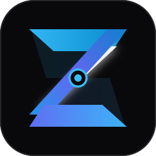

<div align="center">



<br />
<br />

# Ziref

**Developer Infrastructure · Continuous Deployment · Web-to-Mobile Platform**

<br />

[](LICENSE)
[](https://www.python.org/)
[](https://fastapi.tiangolo.com/)
[](https://nextjs.org/)
[](https://www.mongodb.com/)
[](https://redis.io/)
[](docker-compose.yml)
[](tests/)
[](docs/ARCHITECTURE.md)

<br />

[Overview](#overview) · [Architecture](#architecture) · [Capabilities](#capabilities) · [Repository Layout](#repository-layout) · [Quickstart](#quickstart) · [CLI](#developer-cli) · [API Reference](#api-reference) · [Documentation](#documentation)

</div>

---

## Overview

Ziref is a self-hostable, production-grade developer infrastructure platform for automating the full software delivery lifecycle from source archive to live deployment and native mobile distribution.

A developer submits a raw project archive (`.zip`) or a public Git repository URL. Ziref automatically detects the project's framework and build toolchain, provisions an isolated ephemeral Docker sandbox with enforced resource quotas, compiles the distribution bundle, atomically serves the immutable deployment behind a hardened multi-tenant reverse router, and optionally packages the deployed web application into an installable Android APK — without requiring any Gradle or Android SDK configuration from the developer.

The platform is designed to operate with **zero external runtime dependencies** during local development: when MongoDB and Redis are unavailable, Ziref automatically activates embedded in-memory fallback datastores, enabling the full build-deploy-preview pipeline on any machine with nothing more than Python and Node.js installed.

---

## Architecture

```
                         ┌──────────────────────────────────────┐
                         │           Ingestion Channels          │
                         │  Dashboard (Next.js 15) · CLI · Git   │
                         └──────────────────┬───────────────────┘
                                            │  ZIP / Git URL
                                            ▼
                         ┌──────────────────────────────────────┐
                         │         Ziref API Gateway            │
                         │         FastAPI · Port 8000          │
                         │                                      │
                         │  • JWT + bcrypt Authentication       │
                         │  • Fernet Encrypted Secret Storage   │
                         │  • Archive Security Validation       │
                         │  • Framework Analyzer                │
                         │  • SSE Log Streaming                 │
                         └───────────┬──────────────┬───────────┘
                                     │              │
                          Push Job   │              │  Persist
                                     ▼              ▼
                   ┌─────────────────────┐  ┌──────────────────────┐
                   │   Redis Job Broker  │  │   MongoDB Datastore   │
                   │                     │  │                       │
                   │  build queue        │  │  Users & Projects     │
                   │  deploy queue       │  │  Builds & Events      │
                   │  app_build queue    │  │  Deployments          │
                   │  Pub/Sub channels   │  │  Encrypted Env Vars   │
                   └──────────┬──────────┘  └──────────────────────┘
                              │  Consume
                              ▼
                   ┌──────────────────────────────────────────────┐
                   │             Isolated Worker Daemon           │
                   │                                              │
                   │  • Ephemeral Docker Sandbox (cgroups)        │
                   │  • Subprocess Fallback Runner                │
                   │  • Real-Time SSE via Redis Pub/Sub           │
                   │  • Build Failure Diagnostic Engine           │
                   │  • Android Kotlin APK Compiler               │
                   └──────────────────────┬───────────────────────┘
                                          │  Store Artifact
                                          ▼
                   ┌──────────────────────────────────────────────┐
                   │          Storage & Atomic Routing            │
                   │                                              │
                   │  artifacts/  ·  deployments/  ·  mobile/    │
                   │  Dynamic Site Router · Port 8080             │
                   │  Custom Domain Resolution                    │
                   │  Security Header Injection                   │
                   └──────────────────────────────────────────────┘
```

### Service Topology

| Service | Runtime | Port | Responsibility |
|---|---|---|---|
| `api` | FastAPI / Uvicorn | `8000` | REST API, Auth, SSE, Embedded Worker |
| `worker` | Python asyncio daemon | — | Build executor, APK compiler, Webhook dispatch |
| `deployer` | FastAPI / Uvicorn | `8080` | Reverse proxy, SPA routing, domain resolution |
| `dashboard` | Next.js 15 App Router | `3000` | Developer console UI |
| `mongodb` | MongoDB 7.0 | `27017` | Primary datastore |
| `redis` | Redis 7 Alpine | `6379` | Job broker, Pub/Sub, routing cache |

---

## Capabilities

### Polyglot Framework Detection

The analyzer engine deterministically inspects extracted project trees without executing any user code. It reads `package.json`, lockfiles (`pnpm-lock.yaml`, `package-lock.json`, `yarn.lock`, `bun.lockb`), and framework config manifests (`vite.config.*`, `next.config.*`, `angular.json`, `svelte.config.*`, `astro.config.*`) to infer the build command, output directory, and package manager. Supported targets: Vite, React, Next.js, Vue, Angular, Svelte, Astro, Node.js, static HTML.

### Sandboxed Build Execution

Build jobs execute inside ephemeral Docker containers pulled from a configurable sandbox image (`node:20-alpine` by default). Each container is subject to hard resource constraints enforced via Linux cgroups:

| Constraint | Default |
|---|---|
| CPU | 1.0 vCPU |
| Memory | 1024 MB |
| Max PIDs | 128 |
| Timeout | 300 seconds |

Non-root user (`builduser`, UID 10001) is enforced. On machines where Docker is unavailable, the worker automatically falls back to an isolated subprocess runner.

**Archive security controls**: Zip Slip directory traversal canonicalization, decompression bomb rejection (100:1 ratio limit, 250 MB extracted size cap, 10,000 file count cap), symlink escape detection, and dangerous filetype blocking (Unix sockets, named pipes).

### Atomic Immutable Deployments

Every successful build produces a SHA-256-verified `.tar.gz` distribution artifact extracted to an isolated directory path (`storage/deployments/{deployment_id}/`). Active traffic is switched by updating a single pointer in Redis and MongoDB — no file copy, no downtime, no rebuild. Rolling back to any prior successful deployment takes effect in under one second.

### Web-to-Native Android Distribution (Appify Engine)

Any deployed web application can be transformed into an installable Android APK with a single API call. The engine generates a complete Android Studio / Gradle project:

- `MainActivity.kt` — `WebViewClient` shell with DOM storage, file upload, pull-to-refresh (`SwipeRefreshLayout`), and offline fallback
- Adaptive vector app icons (`mipmap-anydpi-v26`)
- Selectable hardware permission bindings: `CAMERA`, `ACCESS_FINE_LOCATION`, `POST_NOTIFICATIONS`, `RECORD_AUDIO`
- Compiled debug `.apk` served as a direct download artifact
- Full Gradle source `.zip` archive for developers requiring native customization

### Dynamic Multi-Tenant Site Router

The site router resolves live traffic through three routing strategies simultaneously:

- **Subdomain**: `http://<slug>.localhost:8080`
- **Path prefix**: `http://localhost:8080/sites/<slug>/`
- **Custom CNAME**: `http://app.yourdomain.com` (verified in the domains collection)

All responses receive production-grade HTTP security headers: `X-Content-Type-Options: nosniff`, `X-Frame-Options: SAMEORIGIN`, `X-XSS-Protection`, `Referrer-Policy`, and `Permissions-Policy`. Hashed static assets (`.js`, `.css`, `/assets/`) receive `Cache-Control: public, max-age=31536000, immutable`. Entry points (`index.html`) receive `no-cache`. Gzip streaming compression is applied at the middleware layer.

### Real-Time Log Streaming

Build logs are captured as structured events (`timestamp`, `stage`, `level`, `message`) and published to Redis Pub/Sub channel `build:{build_id}:logs`. The API gateway exposes these as Server-Sent Events (SSE) streams consumed directly by the dashboard terminal viewer with sub-50ms latency. Access logs from the site router are similarly streamed.

### Build Failure Diagnostics

The diagnostic engine inspects stdout/stderr streams from failed builds and classifies failures into one of eight categories: `MISSING_DEPENDENCY`, `MISSING_BUILD_SCRIPT`, `COMMAND_NOT_FOUND`, `OUTPUT_DIRECTORY_MISSING`, `OUT_OF_MEMORY`, `TYPESCRIPT_ERROR`, `SYNTAX_ERROR`, `ENV_VAR_MISSING`. Each classification produces a human-readable root-cause summary and copy-pasteable remediation commands surfaced in both the dashboard and CLI.

### Traffic Analytics

Per-deployment access metrics are aggregated from site router access logs: total request count, unique visitor count, response status code distribution (2xx/3xx/4xx/5xx), average and p95 latency, top-accessed paths, and device-class distribution (Desktop / Mobile / Tablet).

### HMAC Webhook Notifications

Outbound webhook deliveries are signed with `X-Ziref-Signature: sha256=<hmac>` using HMAC-SHA256 keyed on a per-project secret. Events delivered: `build.completed`, `build.failed`, `deployment.ready`. Compatible with Slack, Discord, and arbitrary HTTP endpoints.

### Encrypted Secret Management

Environment variables are encrypted at rest using Fernet symmetric encryption (AES-128-CBC + HMAC-SHA256). Secrets are masked in all API responses and injected into sandbox containers only during build execution as ephemeral environment variables.

---

## Security Architecture

Defense-in-depth is applied across every stage of the pipeline.

**Archive Ingestion**
- Zip Slip traversal: explicit path canonicalization on every extracted entry against the target directory boundary
- Decompression bombs: compressed-to-uncompressed byte ratio capped at 100:1; absolute extracted size capped at 250 MB
- Dangerous entry types: Unix sockets, named pipes, and out-of-boundary symlinks are rejected at extraction time

**Sandbox Isolation**
- Non-root execution (UID 10001) inside Docker containers
- Docker socket (`/var/run/docker.sock`) is not mounted into sandbox containers
- Hard resource constraints via Linux cgroups (CPU, memory, PIDs)

**Multi-Tenant Authorization**
- Every resource (project, build, deployment, secret, mobile artifact) is tagged with a tenant `user_id`
- FastAPI dependency injection verifies ownership on every API endpoint before any operation is performed

**Credential Storage**
- JWT tokens signed with HS256; configurable expiry (default 24 hours)
- User passwords hashed with bcrypt (cost factor 12)
- Environment variable secrets encrypted with Fernet before MongoDB persistence

---

## Repository Layout

```
ziref/
├── apps/
│   └── dashboard/                  Next.js 15 App Router developer console
│       ├── app/                    Page routes (dashboard, projects, builds, analytics, appify)
│       ├── components/             Shared UI components (TerminalViewer, StatusBadge, CommandPalette)
│       └── lib/                    API client, auth context, theme, toast, date utilities
│
├── packages/
│   ├── cli/                        Ziref Developer CLI (zero runtime dependencies)
│   │   ├── main.py                 Entry point, argument parsing, ANSI output formatting
│   │   ├── client.py               HTTP client with multipart upload and streaming support
│   │   └── config.py               Credential storage (~/.ziref/config.json)
│   └── types/                      Shared TypeScript type definitions (@ziref/types)
│
├── services/
│   ├── analyzer/                   Framework detection and archive security
│   │   ├── archive_validator.py    Zip Slip, bomb detection, symlink mitigation
│   │   ├── detector.py             Deterministic manifest and lockfile framework analyzer
│   │   └── git_importer.py         Shallow git clone with URL sanitization
│   │
│   ├── api/                        Core REST API (FastAPI)
│   │   ├── core/                   Database (Mongo + embedded fallback), Redis, config, security
│   │   ├── routers/                Auth, Projects, Uploads, Builds, Deployments, Domains,
│   │   │                           Analytics, Webhooks, Apps, Runtime Logs, Health
│   │   └── schemas/                Pydantic v2 request/response contracts
│   │
│   ├── builder/                    Build pipeline and sandbox execution
│   │   ├── docker_sandbox.py       Docker container orchestration and subprocess fallback
│   │   ├── build_executor.py       Pipeline coordinator, tarball packaging, log emission
│   │   └── diagnostics.py          Build failure classification engine
│   │
│   ├── deployer/                   Atomic deployment and site routing
│   │   ├── deployer_service.py     Tarball unpacking, zero-downtime pointer swap, rollback
│   │   └── site_router.py          Multi-tenant reverse proxy, custom domains, header injection
│   │
│   ├── app_builder/                Web-to-Android packaging engine
│   │   ├── android_generator.py    Kotlin project generation, adaptive icons, permissions
│   │   └── apk_builder.py          Debug APK compilation pipeline
│   │
│   └── worker/                     Asynchronous background job daemon
│       └── main.py                 Queue consumer, job dispatcher, concurrency controller
│
├── infrastructure/
│   └── docker/                     Per-service Dockerfiles (api, worker, deployer, dashboard, sandbox)
│
├── scripts/
│   ├── dev.ps1                     One-command: all services in parallel (color-coded output)
│   ├── test.ps1                    Full automated test and build verification
│   └── ziref.ps1                   CLI wrapper for Windows
│
├── tests/
│   ├── unit/                       Isolated unit tests (diagnostics, analytics, archive validation)
│   └── integration/                End-to-end pipeline tests (build, deploy, router, APK, git import)
│
├── docs/                           Technical specifications
│   ├── ARCHITECTURE.md             Subsystem topology, data models, queue flows
│   ├── API.md                      REST and SSE endpoint reference
│   ├── SECURITY.md                 Threat model, sandbox constraints, mitigation matrix
│   ├── DEPLOYMENT.md               Production scaling, SSL termination, orchestration
│   ├── PRD.md                      Product requirements and scope definition
│   └── ROADMAP.md                  Phased development roadmap
│
├── docker-compose.yml              Full-stack production container orchestration
├── requirements.txt                Python backend dependencies
└── .env.example                    Environment variable reference template
```

---

## Data Store Schema

| Collection | Key Fields | Purpose |
|---|---|---|
| `users` | `_id`, `email`, `password_hash`, `name`, `created_at` | User identities |
| `projects` | `_id`, `user_id`, `name`, `slug`, `framework`, `active_deployment_id` | Project definitions |
| `uploads` | `_id`, `project_id`, `file_size`, `checksum`, `storage_path`, `analysis` | Uploaded archive records |
| `builds` | `_id`, `project_id`, `upload_id`, `status`, `exit_code`, `duration_seconds` | Build execution records |
| `build_events` | `_id`, `build_id`, `timestamp`, `stage`, `level`, `message` | Structured build log events |
| `deployments` | `_id`, `project_id`, `build_id`, `status`, `url`, `artifact_path` | Immutable deployment records |
| `environment_variables` | `_id`, `project_id`, `key`, `encrypted_value`, `is_secret` | Fernet-encrypted project secrets |
| `mobile_apps` | `_id`, `project_id`, `app_name`, `package_id`, `version`, `theme` | Android app configurations |
| `mobile_builds` | `_id`, `mobile_app_id`, `status`, `apk_artifact_id`, `source_artifact_id` | Android build records |

---

## Quickstart

### Prerequisites

| Requirement | Version | Notes |
|---|---|---|
| Python | 3.11+ | Core backend runtime and CLI |
| Node.js | 20+ | Next.js 15 dashboard |
| pnpm | 9+ | Monorepo workspace manager |
| Docker Desktop | Optional | Enables sandboxed builds; embedded fallback activates automatically when unavailable |

---

### 1. Clone and Configure

```bash
git clone https://github.com/Chetan0e/Ziref.git
cd Ziref
cp .env.example .env
```

Edit `.env` and set a strong `JWT_SECRET` and `ENCRYPTION_KEY`. All other values work as-is for local development.

---

### 2. Install Dependencies

```bash
# Python backend
python -m venv .venv
.venv\Scripts\activate          # Windows
source .venv/bin/activate       # macOS / Linux
pip install -r requirements.txt

# Node.js dashboard
pnpm install
```

---

### 3. Run the Test Suite

Verify the full backend test suite and Next.js production build before starting:

```powershell
powershell -ExecutionPolicy Bypass -File scripts/test.ps1
```

Expected output:
```
==> Running Python Unit & Integration Tests...
============================= 35 passed in 8.87s ==============================
==> Verifying Dashboard Build & Types...
 ✓ Compiled successfully
 ✓ Generating static pages (9/9)
==> All Tests and Builds Passed Successfully.
```

---

### 4. Start All Services

#### Option A — Unified launcher (recommended)

Starts all four services in parallel with color-coded log output. Press `Ctrl+C` to stop all services cleanly.

```powershell
powershell -ExecutionPolicy Bypass -File scripts/dev.ps1
```

> The launcher attempts to connect to local MongoDB and Redis. If neither is running, embedded in-memory fallback datastores are activated automatically. No configuration change is required.

#### Option B — Individual service terminals

Run each service in a separate terminal session. Services connect to each other automatically regardless of start order.

**API Gateway**
```powershell
.venv\Scripts\uvicorn services.api.main:app --port 8000 --reload
```

**Worker Daemon**
```powershell
.venv\Scripts\python -m services.worker.main
```

**Site Router**
```powershell
.venv\Scripts\python -m services.deployer.main
```

**Dashboard**
```powershell
pnpm --filter dashboard dev
```

#### Option C — Docker Compose (full stack)

```bash
docker compose up -d
docker compose logs -f      # stream all service logs
docker compose down         # stop and remove containers
```

---

### 5. Service Endpoints

| Service | URL | Notes |
|---|---|---|
| Dashboard | `http://localhost:3000` | Developer console |
| API Gateway | `http://localhost:8000` | Core REST API |
| OpenAPI Docs | `http://localhost:8000/docs` | Interactive Swagger UI |
| ReDoc | `http://localhost:8000/redoc` | Alternative API reference |
| Site Router | `http://localhost:8080` | Deployed site preview |
| Deployed Site | `http://<slug>.localhost:8080` | Per-project subdomain routing |

---

## Developer CLI

The Ziref CLI provides end-to-end project management from the terminal without opening the dashboard.

```bash
# Authenticate
python -m packages.cli.main login
# Windows shorthand:
.\scripts\ziref.ps1 login

# Show authenticated identity
.\scripts\ziref.ps1 whoami

# List all projects and their live URLs
.\scripts\ziref.ps1 list

# Deploy the current working directory
.\scripts\ziref.ps1 deploy

# Package a project as a native Android APK and download it
.\scripts\ziref.ps1 appify <project-slug>

# Tail live build logs for a build ID
.\scripts\ziref.ps1 logs <build-id>
```

Credentials are persisted locally at `~/.ziref/config.json`. The CLI has zero runtime dependencies beyond the Python standard library.

---

## API Reference

The full REST and SSE API is documented in [`docs/API.md`](docs/API.md). The interactive Swagger explorer is available at `http://localhost:8000/docs` when the API Gateway is running.

**Base URL**: `http://localhost:8000/api/v1`

**Authentication**: Bearer token in `Authorization: Bearer <token>` header, obtained from `POST /api/v1/auth/login`.

Selected endpoints:

| Method | Path | Description |
|---|---|---|
| `POST` | `/auth/register` | Create a new user account |
| `POST` | `/auth/login` | Obtain a JWT access token |
| `GET` | `/projects` | List all projects for the authenticated user |
| `POST` | `/projects` | Create a project |
| `POST` | `/uploads/{project_id}` | Upload a project archive (multipart) |
| `POST` | `/builds` | Trigger a build from an upload |
| `GET` | `/builds/{build_id}/logs/stream` | SSE stream of real-time build logs |
| `POST` | `/deployments/{build_id}` | Promote a successful build to production |
| `POST` | `/deployments/{deployment_id}/rollback` | Roll back to a prior deployment |
| `POST` | `/apps/{project_id}/appify` | Initiate Android APK generation |
| `GET` | `/analytics/{project_id}` | Retrieve traffic analytics |
| `GET` | `/health` | Health probe |
| `GET` | `/ready` | Readiness probe |

---

## Environment Variables

| Variable | Default | Description |
|---|---|---|
| `APP_ENV` | `development` | Runtime environment (`development` / `production`) |
| `MONGODB_URI` | `mongodb://localhost:27017/ziref` | MongoDB connection string |
| `REDIS_URL` | `redis://localhost:6379/0` | Redis connection string |
| `JWT_SECRET` | — | Secret key for JWT signing (**must be overridden in production**) |
| `JWT_ALGORITHM` | `HS256` | JWT signing algorithm |
| `ACCESS_TOKEN_EXPIRE_MINUTES` | `1440` | Token expiry in minutes (24 h) |
| `ENCRYPTION_KEY` | — | Fernet key for secret encryption (**must be overridden in production**) |
| `STORAGE_PROVIDER` | `local` | Storage backend (`local` or `s3`) |
| `STORAGE_PATH` | `./storage` | Local storage root directory |
| `BUILD_CPU_LIMIT` | `1.0` | Docker CPU quota per build container |
| `BUILD_MEMORY_LIMIT` | `1024m` | Docker memory limit per build container |
| `BUILD_TIMEOUT_SECONDS` | `300` | Maximum build duration in seconds |
| `WORKER_CONCURRENCY` | `4` | Parallel job capacity of the worker daemon |
| `SANDBOX_IMAGE` | `node:20-alpine` | Docker image used for build sandboxes |
| `BASE_DOMAIN` | `localhost:8080` | Domain used for constructing deployment URLs |

---

## Testing

```bash
# Full test suite
.venv\Scripts\python -m pytest tests/ -v

# Targeted suites
.venv\Scripts\python -m pytest tests/unit/test_diagnostics.py -v
.venv\Scripts\python -m pytest tests/unit/test_analytics.py -v
.venv\Scripts\python -m pytest tests/integration/test_demo_flow.py -v
.venv\Scripts\python -m pytest tests/integration/test_router_security.py -v
.venv\Scripts\python -m pytest tests/integration/test_e2e_html_and_apk.py -v
.venv\Scripts\python -m pytest tests/integration/test_static_and_mobile_pipeline.py -v
```

The test suite covers: framework detection, archive security validation, build diagnostics, analytics aggregation, site router security, custom domain resolution, end-to-end HTML deployment, APK generation pipeline, and Git import flows.

---

## Documentation

| Document | Description |
|---|---|
| [`docs/ARCHITECTURE.md`](docs/ARCHITECTURE.md) | Subsystem topology, data models, queue flows |
| [`docs/API.md`](docs/API.md) | Full REST and SSE endpoint reference |
| [`docs/SECURITY.md`](docs/SECURITY.md) | Threat model, sandbox constraints, mitigation matrix |
| [`docs/DEPLOYMENT.md`](docs/DEPLOYMENT.md) | Production scaling, SSL termination, orchestration |
| [`docs/PRD.md`](docs/PRD.md) | Product requirements, scope, and design principles |
| [`docs/ROADMAP.md`](docs/ROADMAP.md) | Phased development roadmap |
| [`CHANGELOG.md`](CHANGELOG.md) | Release history |
| [`CONTRIBUTING.md`](CONTRIBUTING.md) | Contribution workflow and code standards |
| [`SECURITY.md`](SECURITY.md) | Vulnerability disclosure policy |

---

## Contributing

Contributions are welcome. Read [`CONTRIBUTING.md`](CONTRIBUTING.md) for the development workflow, branch naming conventions, commit message standards, and code review process.

---

## License

Ziref is released under the [MIT License](LICENSE).

Copyright © 2026 Ziref Contributors.
